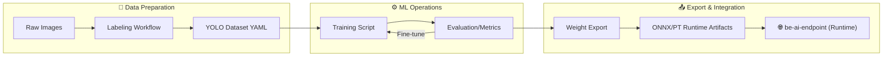

# be-ai-endpoint-model


> 산업안전 CCTV를 위한 AI 모델 학습 및 내보내기 저장소
> AI Model Training, Evaluation, and Export for Industrial Safety CCTV

---

## 🎯 Overview | 개요

### English

This repository is dedicated to the training, evaluation, and exporting of models for the `be-ai-endpoint` runtime pipeline. It isolates heavy ML dependencies, large datasets, and experimental logs from the production runtime code.

**Key Scope:**

- **Data Prep**: Standardized labeling and dataset organization.
- **ML Operations**: Training, validation, and hyperparameter tuning (Ultralytics/YOLO).
- **Export**: Generating optimized `.pt` and `.onnx` artifacts.
- **Contract Alignment**: Maintaining class taxonomy consistent with the runtime pipeline.

### 한국어

이 저장소는 `be-ai-endpoint` 런타임 파이프라인에서 사용할 AI 모델의 학습, 평가 및 내보내기(Export)를 전담합니다. 무거운 ML 의존성, 대규모 데이터셋, 실험 로그를 운영 환경과 분리하여 관리합니다.

**주요 기능:**

- **데이터 준비**: 표준화된 라벨링 및 데이터셋 구조 관리.
- **모델 운영**: Ultralytics/YOLO 기반의 학습, 검증 및 튜닝.
- **결과 내보내기**: 최적화된 `.pt` 및 `.onnx` 산출물 생성.
- **규약 정합성**: 런타임 파이프라인과 일관된 클래스 분류(Taxonomy) 유지.

---

## 🏗️ Model Lifecycle | 모델 생명주기



---

## ⚡ Quickstart | 빠른 시작

### 1. Environment Setup

```bash
# 1. Clone
git clone <repo-url>
cd be-ai-endpoint-model

# 2. Windows Setup (Recommended)
./setup_env.ps1

# 3. Linux/Bash Setup
pip install -r requirements.txt
export PYTHONPATH=$PYTHONPATH:$(pwd)/src
```

### 2. Basic Workflows

```bash
# Train a model
python scripts/train.py --weights yolov8n.pt --epochs 10 --img-size 640

# Evaluate metrics
python scripts/eval.py --weights models/model_export.pt --data datasets/data.yaml

# Export to ONNX
python scripts/export.py --weights models/model_export.pt --format onnx
```

---

## 🔧 Core Workflows | 핵심 워크플로우

| Feature | Script | Description |
| :--- | :--- | :--- |
| **Train** | `scripts/train.py` | 학습 실행 (weights, epochs, batch 등 오버라이드 지원) |
| **Eval** | `scripts/eval.py` | 모델 성능 검증 및 지표 산출 |
| **Export** | `scripts/export.py` | 파이프라인 연동용 형식(ONNX/PT)으로 내보내기 |
| **Base** | `scripts/_common.py` | 공통 유틸리티 및 데이터셋 경로 자동 검증 |

---

## 📚 Documentation Index | 문서 인덱스

| English | 한국어 | Description |
| :--- | :--- | :--- |
| [Pipeline Integration](docs/contracts/pipeline_integration.md) | [파이프라인 연동 규약](docs/contracts/pipeline_integration.md) | 런타임-모델 간의 기술적 계약 |
| [Model Interface](docs/specs/model_interface.md) | [모델 인터페이스](docs/specs/model_interface.md) | 어댑터 입출력 규격 |
| [Class Taxonomy](docs/specs/model_class_taxonomy.md) | [클래스 분류 세계](docs/specs/model_class_taxonomy.md) | 탐지 대상 및 이벤트 명세 |
| [Ops Guide](docs/ops/quickstart.md) | [운영 가이드](docs/ops/quickstart.md) | 상세 실행 및 이슈 처리 |

---

## 🤝 Contributing | 기여

1. Fork this repository
2. Create a feature branch
3. Submit a Pull Request

---

<p align="center">
  Made with ❤️ by <b>Team Bug-24</b>
  <br>
  Copyright (c) 2026. All rights reserved.
</p>
